# Jesse W Spencer | Every Body Walk!

**URL:** https://www.jessewspencer.com/ebw

## Every Body Walk!

Product design for Kaiser Permanente.

### Approach

A beautiful, minimal interface inspired by the industrial designs of Dieter Rams.

### Philosophy

An experience focused on a single interactive dial. Remove the barrier to entry, encourage exercise.

### Trend Setting

Real time progress tracking. We did it before Apple Fitness thought it was cool.

### Visual Design

Did someone say skeuomorphic? Buttons so realistic, you can't help but touch it.

### Objectives

Easily track your goals for distance, time, and calories.

### Outcomes

The Every Body Walk! app was downloaded over 126k times post launch and received a Silver Web Health Mobile Award from the prestigious Health Information Resource Center. Throughout the life of the app, Kaiser Permanante reported that the Every Body Walk! campaign continued to expand its reach and ability to engage members through regular, habit-formed touchpoints.

### EBW! Awards

**Apple:**

**Yahoo! News:**

**AppAdvice.com:**

### Silver in the Web Health Mobile Awards

**Additional Credits:**

### Carlos Gazulos

---

## Images

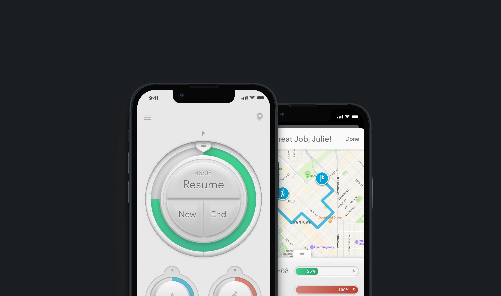

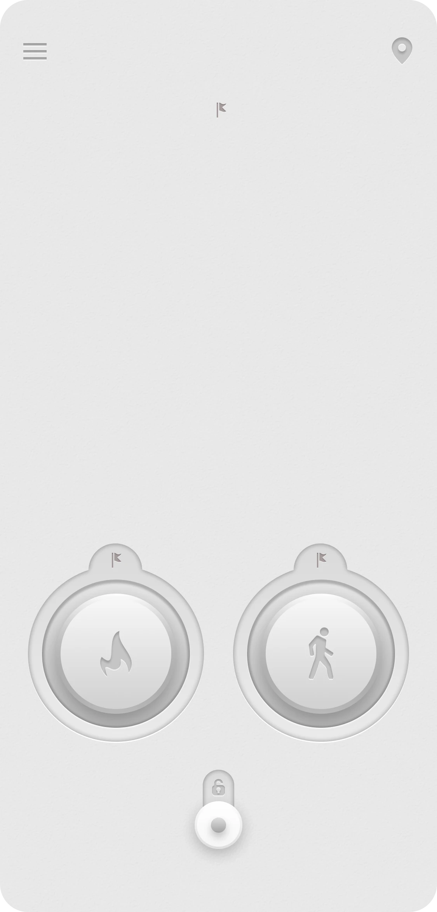

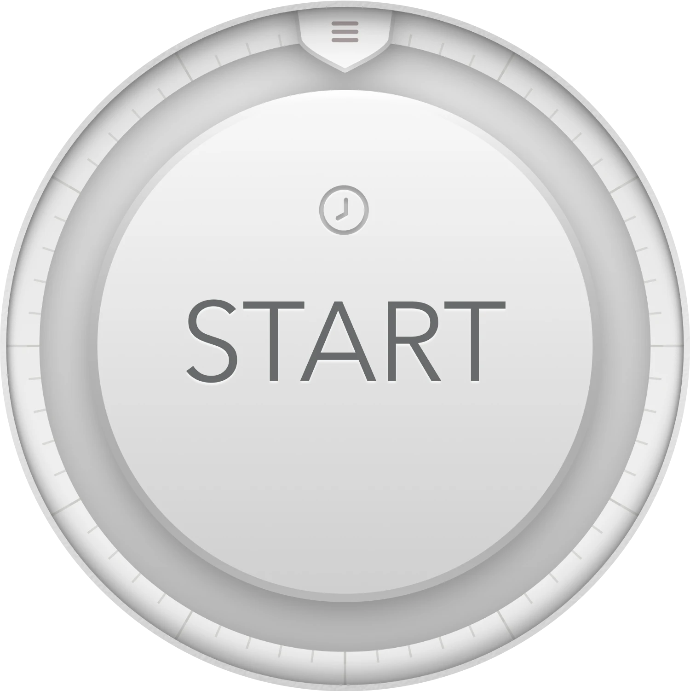

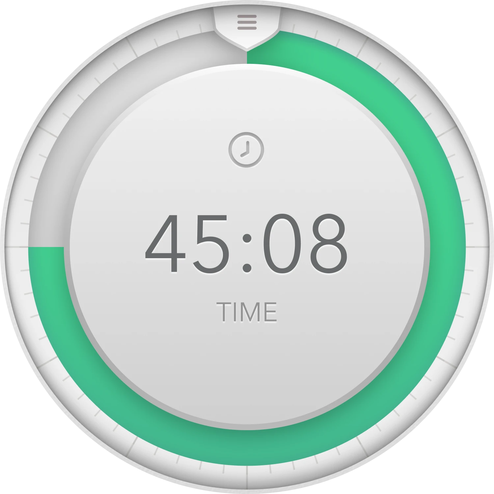

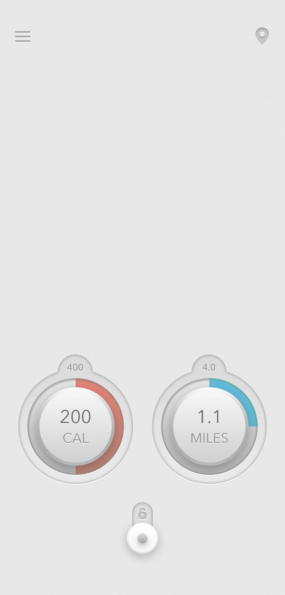

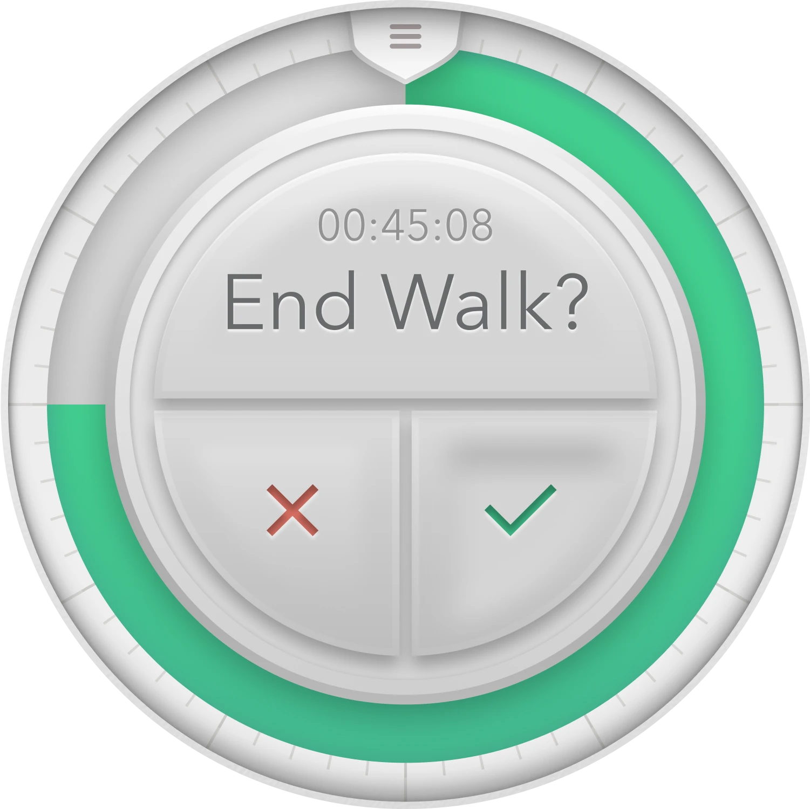

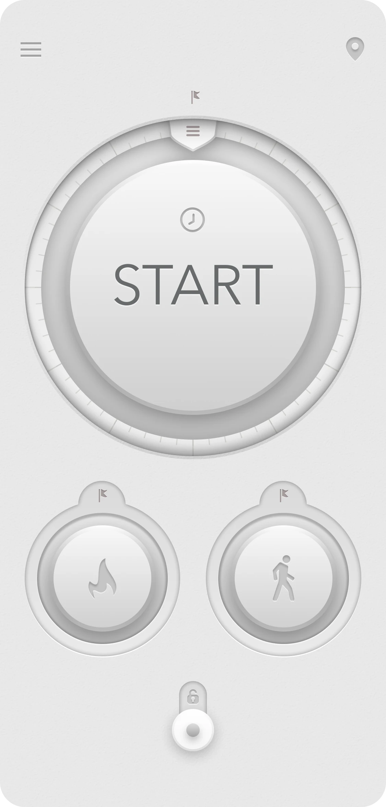

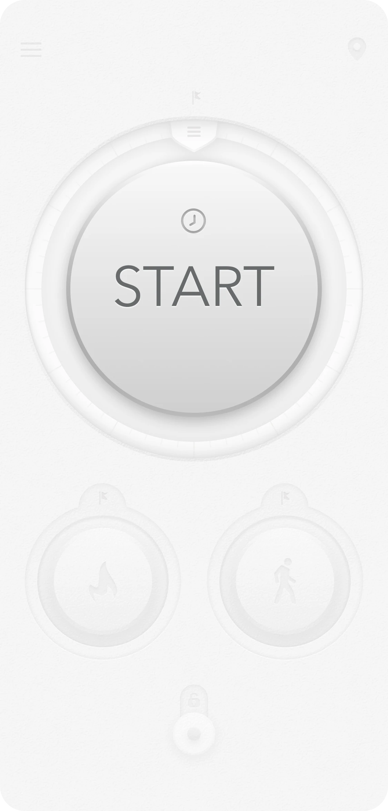

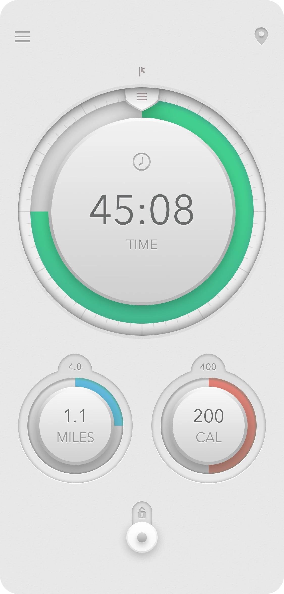

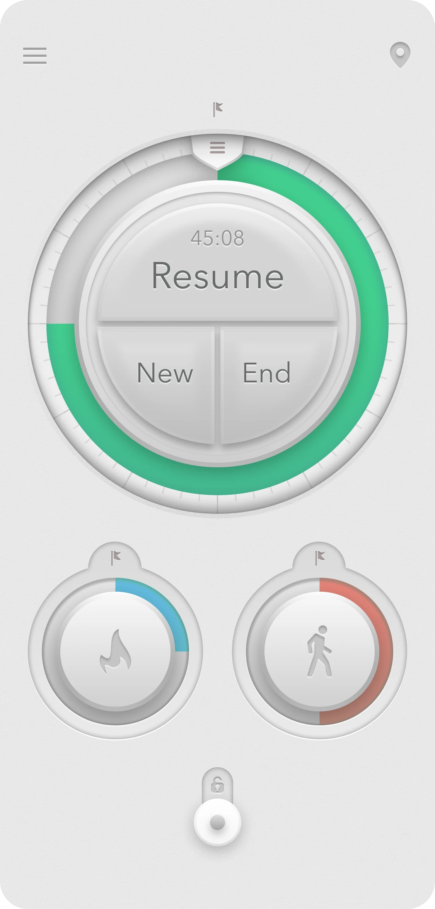

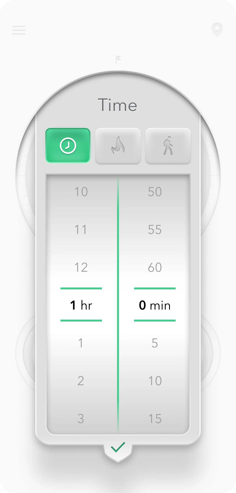

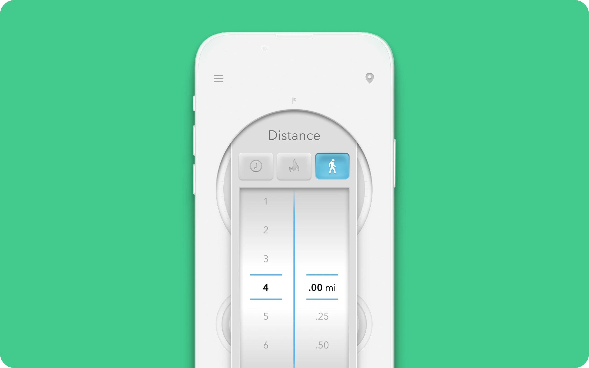

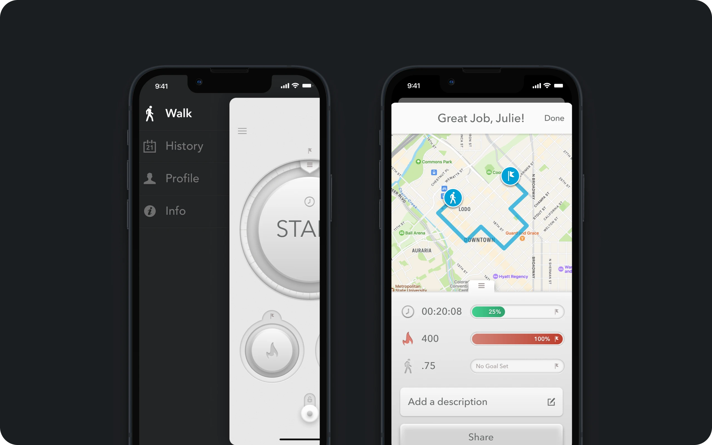

