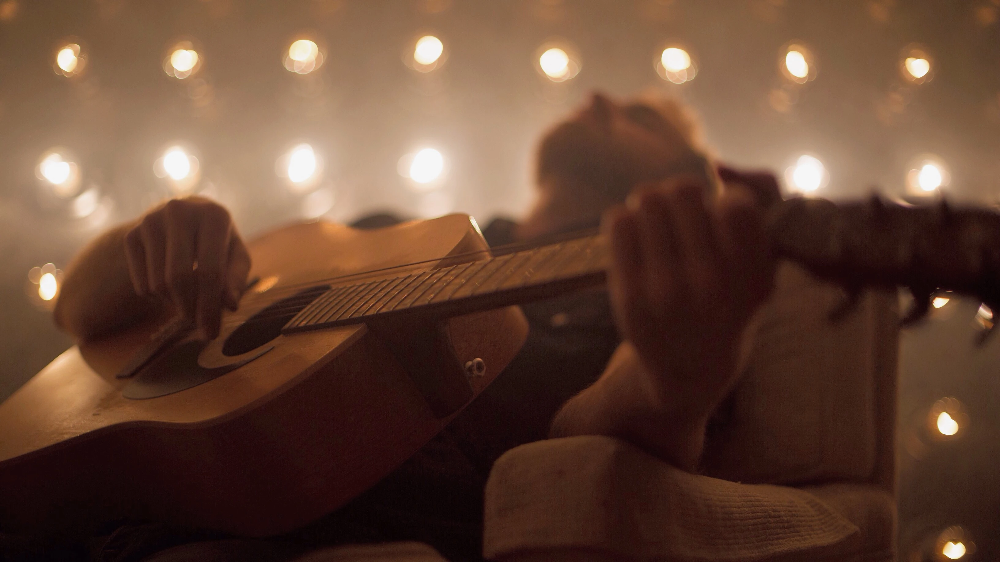

# Jesse W Spencer | Music

**URL:** https://www.jessewspencer.com/music

### For as long as I can remember, I’ve been playing music.

### Breach & Bellow

### My personal songwriting journey.

### All I Have

### Burn the Effigy

### Brand New Day

### Collaboration

### These are some projects I've enjoyed the most.

### Leash of Foxes

### Intricate melodies. Hard hitting drums.

### The Wild After

### Catchy indie folk rock.

### Let's connect.

### Let'sconnect.

#### 2018

#### EP

#### Music Video

#### Album

#### Now Even More Than

#### The Sun Will Rise

#### 2015

#### Credits

#### Videos

#### 2012

#### My role: Drums

Jesse is a songwriter and multi-instrumentalist, best known for touring as a drummer with Atlantic Records artist Matt Hires, supporting acts such as Matchbox Twenty (North Tour), the Goo Goo Dolls (Magnetic Tour), and Parachute (Overnight Tour).

He has performed for radio stations across the U.S., appeared on VH1 and AXS TV, and shared the stage with artists including Copeland, Barcelona, Lifehouse, Finish Ticket, Hellogoodbye, Mat Kearney, Family of the Year, Bronze Radio Return, and Rooney.

Based in Denver, Jesse has been a member of several local bands over the years, including The Wild After, Leash of Foxes, Ivory Circle, Stellan, and POPFILTER.

Currently, he writes, records, and produces under his songwriting moniker, Breach and Bellow—an outlet to tell his own story through ambitious yet vulnerable songs that blend acoustic folk, cinematic soundscapes, neo-classical instrumentation, and intimate lyricism. Reflective yet driven, his work invites listeners into a deeply personal and expansive musical world.

Vocals, Guitars, Piano, Keys, Drums by Jesse W Spencer

Lead Guitar by Ryan Buller

Bass Guitar by Chris Beeble

Produced, Engineered, and Mixed by Chris Beeble at the Blasting Room and Mastered by Stephan Hawkes at Interlace Audio

Additional Musicians: Connie Hong, Randall Kent, Paul Beveridge, Adam Herron, Craig Basarich, Matthew Spencer

Directed, Edited and Shot by Jesse Spencer

Lighting Programmed and Additional Shooting by Rob Spradling

---

## Images

