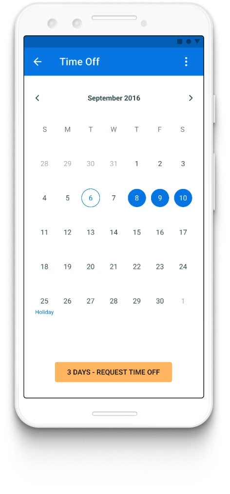
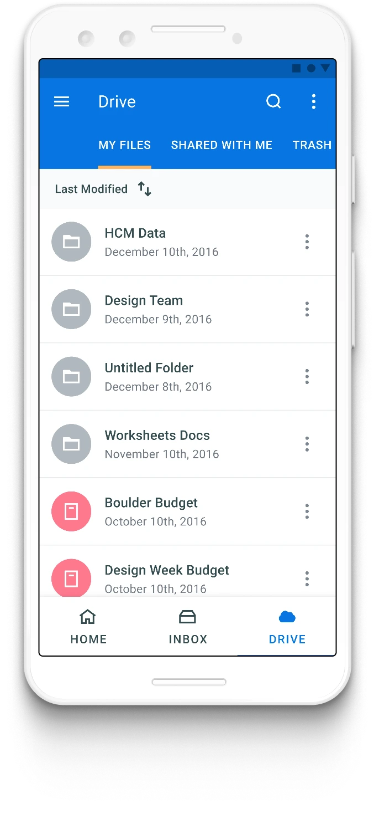
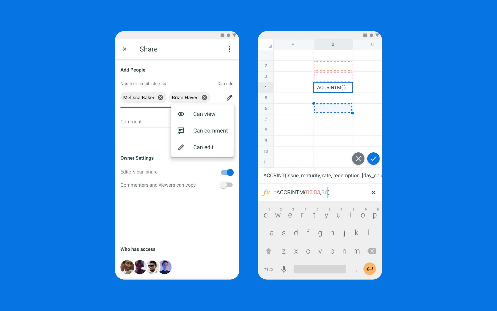
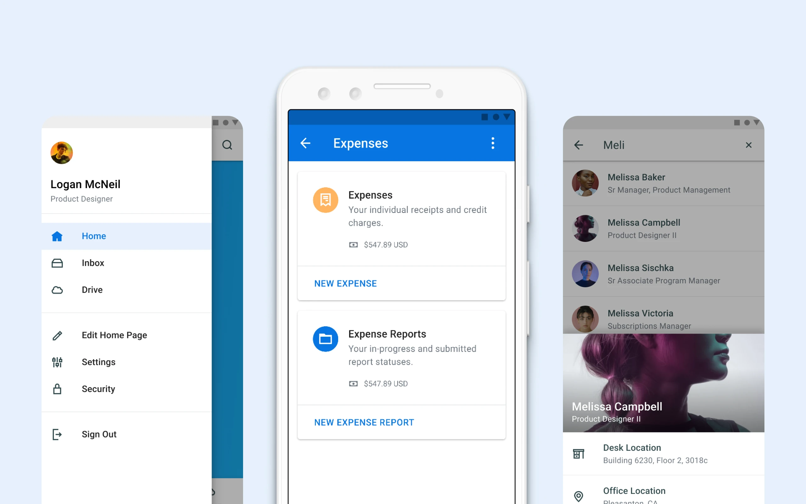

# Jesse W Spencer | Workday Phoenix

**URL:** https://www.jessewspencer.com/workday-phoenix

## Workday Phoenix

Product wide redesign for the Android app.

### Time Off

With 1.5 million time off requests on mobile each month, Time Off is one of Workday's top used tasks. Bringing in a more modern material-like calendar immediately improved the overall experience.

Usability was improved through more inuitive interactions, better wayfinding, and surfacing more contextual user data.

### Navigation

Adding tabbed navigation to the app bar immediately made Inbox and Drive look and behave more like a true Android app.

Introducing material motion throughout the app helped make transitions more energetic and fluid.

---

## Images

